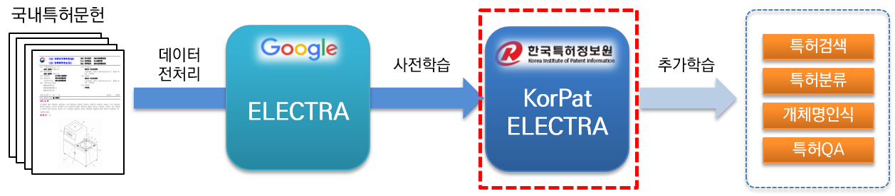

# 특허분야 한국어 AI언어모델 KorPatELECTRA
KorPatELECTRA(Korean Patent ELECTRA)는 [한국특허정보원](https://www.kipi.or.kr)이 연구개발한 AI 언어모델입니다. 
 특허분야 한국어 자연어처리 문제 해결 및 특허산업분야의 지능정보화 인프라 마련을 위해 기존 [Google ELECTRA](https://github.com/google-research/electra) 모델의 아키텍쳐를 기반으로 대용량 국내 특허문헌(약 466만 문헌, 5.4억 문장, 445억 토큰, 130GB)을 사전학습(pre-training)하였고, 무료로 제공하고 있습니다.
KorPatELECTRA 관련 내용은 [KorPatELECTRA 논문](https://www.koreascience.or.kr/article/JAKO202209537230844.page)에서 확인 할 수 있습니다.
&nbsp;

## 
- [1. KorPatELECTRA](#1-korpatelectra)
- [2. KorPatELECTRA 개요](#2-korpatelectra-개요)
  - [2-1. 사전학습 환경](#2-1-사전학습-환경)
  - [2-2. 코퍼스](#2-2-코퍼스)
  - [2-3. 사전 및 토크나이저](#2-3-사전-및-토크나이저)
  - [2-4. 평가](#2-4-평가)
- [3. KorPatELECTRA 사용안내](#3-korpatelectra-사용안내)
  - [3-1. 요구사항](#3-1-요구사항)
  - [3-2. 토크나이저](#3-2-토크나이저)
  - [3-3. 파인튜닝](#3-3-파인튜닝)
- [4. KorPatELECTRA 정책 및 제공](#4-korpatelctra-정책-및-제공)
  - [4-1. 담당부서 및 모델제공 문의](#4-1-담당부서-및-모델제공-문의)
  - [4-2. 사용신청서](#4-2-사용신청서)
  - [4-3. 협약서](#4-3-협약서)
  - [4-4. 라이선스](#4-4-라이선스)
 
&nbsp;
## 1. KorPatELECTRA
2020년에 공개된 [Google ELECTRA Base](https://github.com/google-research/electra) 모델의 아키텍쳐를 기반으로, 대량의 한국어 특허문헌 코퍼스를 사전 학습한 언어모델로, 다양한 특허 자연어처리 태스크에 활용이 가능한 모델입니다.

&nbsp;

&nbsp;
## 2. KorPatELECTRA 개요
### 2-1. 사전학습 환경
#### 개발환경
- Anaconda >=4.6.8
- Python >= 3.7.11
- Tensorflow-gpu >= 1.15.0
- tokenizers == 0.10.3 (BertWordPieceTokenizer)
- MWP Tokenizer(Mecab-ko Wordpiece Patent Tokenizer)

#### 학습환경
- 특허문헌 130GB 코퍼스의 5억 4천만 문장을 학습
- NVIDIA V100 32GB GPU 16개로 tensorflow의 mirrored strategy 및 Horovod를 이용하여 학습
- NVIDIA AMP (Automated Mixed Precision) 방식을 활용하여, 메모리 최적화

### 2-2. 코퍼스
- 특허문헌수 : 4,661,158문헌
- 문장 수 : 546,496,725문장
- 토큰 수 : 44,525,763,134건
- 코퍼스 크기 : 약 130GB

### 2-3. 사전 및 토크나이저
언어모델 학습에 사용된 특허공보 466만건을 대상으로 Soynlp 라이브러리를 이용하여 약 660만개의 명사 및 복합명사를 추출하였으며, 이를 Mecab-ko의 사용자 사전에 추가 후 WordPiece를 통하여 Subword로 분할하는 방식의 토크나이저를 사용하였습니다.
사용자 편의를 위해 [Google BERT](https://github.com/google-research/bert/blob/master/tokenization.py)의 토크나이저 파일을 그대로 사용 가능하며 torch에서는 [Huggingface](https://github.com/huggingface)의 BertWordPieceTokenizer를 사용할 수 있습니다.
- Mecab-ko 특허 사용자 사전파일명 : pat_all_mecab_dic.csv (6,663,693개 용어)
- WordPiece 사전파일명 : vocab.txt (35,000개 토큰)
- WordPiece 스페셜 토큰 : [PAD], [UNK], [CLS], [SEP], [MASK]

### 2-4. 평가
ELECTRA가 BERT 보다 모든 태스크에서 높은 성능을 보였고, KorPatBERT는 특허 CPC분류에서 높은 성능능 달성하였습니다.
특히, KorPatELECTRA는 특허분야 학습 데이터 셋에서 가장 높은 성능 달성하였습니다.
|
 
|
vocab size
|
NER (화학 특허)
|
Classification (특허 CPC분류)
|
MRC (PatQuAD)
|
|:--:|:--:|:--:|:--:|:--:|
|Google BERT|11만|87.98|72.33|51.63/81.36|
|<b>KorPatBERT</b>|<b>21400</b>|<b>87.89</b>|<b>76.32<b>|<b>76.21/85.61</b>|
|KoELECTRA|35000|87.47|72.98|72.45/88.09|
|<b>KorPatELECTRA</b>|<b>35000</b>|<b>91.01</b>|<b>73.90<b>|<b>77.47/89.85</b>|
- NER(화학 특허) : 고분자 복합수지 특허의 개체명
- Classification(특허 CPC분류) : CPC코드(632 labels)가 부여된 특허 문헌 분류
- MRC(PatQuAD) : 특허 상담분야 질의응답 데이터 셋

&nbsp;
## 3. KorPatELECTRA 사용안내
### 3-1. 요구사항
|
프로그램명</centeer>|
버전</centeer>|
설치 안내 경로</centeer>|
필수</centeer>|
|:--:|:--:|:--:|:--:|
|tensorflow|1.15.0|https://www.tensorflow.org/install/pip?hl=ko|Y|
|mecab-ko|0.996-ko-0.0.2|https://bitbucket.org/eunjeon/mecab-ko-dic/src/master/|Y|
|mecab-ko-dic|2.1.1|https://bitbucket.org/eunjeon/mecab-ko-dic/src/master/|Y|
|mecab-python|0.996-ko-0.9.2|https://bitbucket.org/eunjeon/mecab-ko-dic/src/master/|Y|
|python-mecab-ko|1.0.11 이상|https://pypi.org/project/python-mecab-ko/|Y|
	

### 3-2. 토크나이저
Tokenizer를 사용하기 위해서는 Mecab-ko 프로그램이 필수적으로 설치 요구되며, 제공된 특허 사용자사전이 Mecab에 추가 된다면 성능 향상에 더욱 효과적이다. 
	from konlpy.tag import Mecab
	import tokenizer as tokenization

	tokenizer = tokenization.FullTokenizer(vocab_file="vocab.txt",do_lower_case=False)
	tokenizer_vocab = tokenizer.vocab

	# 샘플 문장
	sentence_org = "본 고안은 주로 일회용 합성세제액을 집어넣어 밀봉하는 세제액포의 내부를 원호상으로 열중착하되 세제액이 배출되는 절단부 쪽으로 내벽을 협소하게 형성하여서 내부에 들어있는 세제액을 잘짜질 수 있도록 하는 합성세제 액포에 관한 것이다."

	# 사용자 사전이 추가된 mecab-ko 형태소 분리기로 1차 분리
	m = Mecab()
	sentence_kipi = " ".join(m.morphs(sentence_org))

	# 2차 분리
	tokens = tokenizer.tokenize(sentence_kipi)

	encoded_line = tokenizer.convert_tokens_to_ids(tokens)
	decoded_line = tokenizer.convert_ids_to_tokens(encoded_line)

	print("Length of vocab : ", len(tokenizer_vocab))
	print("Input example : ", sentence_org)
	print("Tokenized example : ", tokens)
	print("Encoded line : ", encoded_line)
	print("Decoded line : ", decoded_line)
	
	
	>>> Length of vocab :  35000
	>>>Input example :  본 고안은 주로 일회용 합성세제액을 집어넣어 밀봉하는 세제액포의 내부를 원호상으로 열중착하되 세제액이 배출되는 절단부 쪽으로 내벽을 협소하게 형성하여서 내부에 들어있는 세제액을 잘짜질 수 있도록 하는 합성세제 액포에 관한 것이다.
	>>> Tokenized example :  ['본', '고안', '은', '주로', '일회용', '합성', '##세제', '##액', '을', '집어넣', '어', '밀봉', '하', '는', '세제', '##액', '##포', '의', '내부', '를', '원호', '상', '으로', '열', '##중', '착하', '되', '세제', '##액', '이', '배출', '되', '는', '절단부', '쪽', '으로', '내벽', '을', '협소', '하', '게', '형성', '하', '여서', '내부', '에', '들', '어', '있', '는', '세제', '##액', '을', '잘', '짜', '질', '수', '있', '도록', '하', '는', '합성', '##세제', '액', '##포', '에', '관한', '것', '이', '다', '.']
	>>> Encoded line :  [1100, 5050, 1674, 6748, 10190, 5147, 27099, 2750, 1675, 28837, 1535, 5795, 2381, 519, 9646, 2750, 2940, 1687, 4771, 881, 9523, 1251, 4682, 1565, 2591, 20032, 618, 9646, 2750, 1692, 4977, 618, 519, 13247, 1886, 4682, 7485, 1675, 14947, 2381, 155, 4689, 2381, 7926, 4771, 1553, 657, 1535, 1703, 519, 9646, 2750, 1675, 1712, 1849, 1840, 1351, 1703, 4692, 2381, 519, 5147, 27099, 1512, 2940, 1553, 4845, 148, 1692, 542, 8]
	>>> Decoded line :  ['본', '고안', '은', '주로', '일회용', '합성', '##세제', '##액', '을', '집어넣', '어', '밀봉', '하', '는', '세제', '##액', '##포', '의', '내부', '를', '원호', '상', '으로', '열', '##중', '착하', '되', '세제', '##액', '이', '배출', '되', '는', '절단부', '쪽', '으로', '내벽', '을', '협소', '하', '게', '형성', '하', '여서', '내부', '에', '들', '어', '있', '는', '세제', '##액', '을', '잘', '짜', '질', '수', '있', '도록', '하', '는', '합성', '##세제', '액', '##포', '에', '관한', '것', '이', '다', '.']
	
	
### 3-3. 파인튜닝
Google electra에서 공개한 학습 방식과 동일하며, torch버전으로는 koelectra를 참고하세요.
- [Google ELECTRA](https://github.com/google-research/electra)
- [KoELECTRA](https://github.com/monologg/KoELECTRA)

&nbsp;
## 4. KorPatELECTRA 정책 및 제공
### 4-1. 담당부서 및 모델제공 문의
- 담당부서 : IP디지털혁신센터 지능정보전략팀
- 모델제공 및 기타문의 : ai_support@kipi.or.kr

#### 제공 순서
1. 사용신청서를 내려받아 작성하여 이메일(ai_support@kipi.or.kr)을 통해 제출합니다.
2. 담당자로부터 회신이 오면 협약서에 서명하여 이메일로 송부합니다.
3. 언어모델 및 사용자 매뉴얼을 제공받습니다.
4. 추후 본 언어모델을 활용하여 상업적 용도로의 사용을 위해서는 라이센스부분을 추가 작성하여 담당자에 보내주시면 관련내용 협의 후 진행이 가능합니다.
   
####  제공 파일
### 4-2. 사용신청서
모델 및 코드를 사용하고자 하시면 사용신청서를 작성하여 제출해주세요.

### 4-3. 협약서
모델 및 코드를 사용할 경우 협약서 내용을 준수해주세요.

### 4-4. 라이선스
모델 및 코드를 사용할 경우 라이선스 내용을 준수해주세요. 특히 상업적 활용을을 위해서는 사전협의가 필요합니다.

